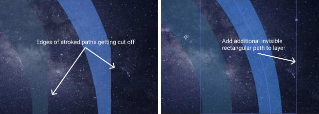

# Getting started
Play Lottie files on the web.

## Static URL
You can use the script file from here:
https://cdnjs.com/libraries/lottie-web

## From Extension
Or get it directly from the AE plugin clicking on Get Player

## lottie light
The extension includes `lottie_light.js` which will play animations exported as svgs.

## NPM
```bash
npm install lottie-web
```

## Bower
```bash
bower install lottie-web
```

# Usage
Call lottie.loadAnimation() to start an animation.
It takes an object as a unique param with:
- animationData: an Object with the exported animation data.
- path: the relative path to the animation object. (animationData and path are mutually exclusive)
- loop: true / false / number
- autoplay: true / false it will start playing as soon as it is ready
- name: animation name for future reference
- renderer: 'svg' / 'canvas' / 'html' to set the renderer
- container: the dom element on which to render the animation


It returns the animation instance you can control with play, pause, setSpeed, etc.

```js
lottie.loadAnimation({
  container: element, // the dom element that will contain the animation
  renderer: 'svg',
  loop: true,
  autoplay: true,
  path: 'data.json' // the path to the animation json
});
```

## Usage
animation instances have these main methods:
- **anim.play()**
- **anim.stop()**
- **anim.pause()**
- **anim.setLocationHref(locationHref)** -- one param usually pass as `location.href`. Its useful when you experience mask issue in safari where your url does not have `#` symbol.
- **anim.setSpeed(speed)** -- one param speed (1 is normal speed)
- **anim.goToAndStop(value, isFrame)** first param is a numeric value. second param is a boolean that defines time or frames for first param
- **anim.goToAndPlay(value, isFrame)** first param is a numeric value. second param is a boolean that defines time or frames for first param
- **anim.setDirection(direction)** -- one param direction (1 is normal direction.)
- **anim.playSegments(segments, forceFlag)** -- first param is a single array or multiple arrays of two values each(fromFrame,toFrame), second param is a boolean for forcing the new segment right away
- **anim.setSubframe(flag)** -- If false, it will respect the original AE fps. If true, it will update as much as possible. (true by default
- **anim.destroy()**

lottie has 8 main methods:
- **lottie.play()** -- with 1 optional parameter **name** to target a specific animation 
- **lottie.stop()** -- with 1 optional parameter **name** to target a specific animation 
- **lottie.setSpeed()** -- first param speed (1 is normal speed) -- with 1 optional parameter **name** to target a specific animation 
- **lottie.setDirection()** -- first param direction (1 is normal direction.) -- with 1 optional parameter **name** to target a specific animation 
- **lottie.searchAnimations()** -- looks for elements with class "lottie" 
- **lottie.loadAnimation()** -- Explained above. returns an animation instance to control individually.
- **lottie.destroy()** -- To destroy and release resources. The DOM element will be emptied. 
- **lottie.registerAnimation()** -- you can register an element directly with registerAnimation. It must have the "data-animation-path" attribute pointing at the data.json url 
- **lottie.setQuality()** -- default 'high', set 'high','medium','low', or a number > 1 to improve player performance. In some animations as low as 2 won't show any difference. 

## Events
- onComplete
- onLoopComplete
- onEnterFrame
- onSegmentStart

you can also use addEventListener with the following events:
- complete
- loopComplete
- enterFrame
- segmentStart
- config_ready (when initial config is done)
- data_ready (when all parts of the animation have been loaded)
- DOMLoaded (when elements have been added to the DOM)
- destroy

#### Other loading options
- if you want to use an existing canvas to draw, you can pass an extra object: 'renderer' with the following configuration:
```js
lottie.loadAnimation({
  container: element, // the dom element
  renderer: 'svg',
  loop: true,
  autoplay: true,
  animationData: animationData, // the animation data
  rendererSettings: {
    context: canvasContext, // the canvas context
    scaleMode: 'noScale',
    clearCanvas: false,
    progressiveLoad: false, // Boolean, only svg renderer, loads dom elements when needed. Might speed up initialization for large number of elements.
    hideOnTransparent: true //Boolean, only svg renderer, hides elements when opacity reaches 0 (defaults to true)
  }
});
```
Doing this you will have to handle the canvas clearing after each frame

Another way to load animations is adding specific attributes to a dom element.
You have to include a div and set it's class to lottie.
If you do it before page load, it will automatically search for all tags with the class "lottie".
Or you can call lottie.searchAnimations() after page load and it will search all elements with the class "lottie".

- add the data.json to a folder relative to the html
- create a div that will contain the animation.

**Required**

- a class called "lottie"
- a "data-animation-path" attribute with relative path to the data.json

**Optional**

- a "data-anim-loop" attribute
- a "data-name" attribute to specify a name to target play controls specifically

**Example**

```html
<div style="width:1067px;height:600px" class="lottie" data-animation-path="animation/" data-anim-loop="true" data-name="ninja"></div>
```

# Previewing Animations

## Lottiefiles.com
If you drag an exported json file onto [lottiefiles.com](http://lottiefiles.com), it will preview it directly in the browser.
You can also share the link or scan the qr code with the [Android](https://play.google.com/store/apps/details?id=com.airbnb.lottie&hl=en) or [iOS](https://itunes.apple.com/us/app/lottie-preview/id1231821260?mt=8) app to preview it there as well.

## Poster snapshot
You can preview or take an svg snapshot of the animation to use as poster. After you render your animation, you can take a snapshot of any frame in the animation and save it to your disk. I recommend to pass the svg through an svg optimizer like https://jakearchibald.github.io/svgomg/ and play around with their settings.<br/>

# Expressions

Unfortunately, expressions are similar to javascript but not quite the same.
So for converting and evaluating the code, I use Esprima and Escodegen.
A subset of expressions is supported.

## Return value in the last line of code.
The returning value must be on the last line. You can't return the value in the middle code.
To workaround this, you can create a var, set the value, and return it in the final line.

## Expression controls
All expression controls are supported. You should have no issues linking any of the supported properties to an expression control.

## Native functions
functions like linear, velocityAtTime and wiggle are not supported.
Probably some will in the near future.
You can set your own function inside the code.

## Use javascript
If you set the string 'use javascript' as the first line of your expression, the plugin won't parse your code and you can get a significant performance increase.
For your code to be javascript compliant, please declare all vars and use operators limited to what javascript supports.
For example don't use an addition operator to sum two arrays.

## valueAtTime

Function `valueAtTime` can only be used in expressions when it is referencing the same property or other non-expression properties.
When calling this function for the other expression property, it will return base property values obtained from keyframes, not an expression result, as it happens in After Effects.
This may lead to some animations not working properly on export. 

For example, this causes issues when exporting [Duik](https://rainboxprod.coop/en/tools/duik/)'s forward kinematics. See [this issue](https://github.com/airbnb/lottie-web/issues/1661) for more information.

As a possible workaround, you can pre-bake expressions into keyframes before export by using `Convert expression to keyframes` feature of After Effects, or any baking plugin. 

# Troubleshooting

## Missing masks
For missing mask in Safari browser, please anim.setLocationHref(locationHref) before animation is generated. It usually caused by usage of base tag in html. (see above for description of setLocationHref)

## Cameras

You can use a 3d one-node or two-node Camera.
Camera options are not exportable. The idea of using a camera is to provide a moving point of view for the composition.
You can parent layers to the camera, but you can't parent the camera to any layer. It will probably be supported soon.

## Masks and 3d don't go well together on browsers.

So if you mask a layer it will lose it's 3d properties. What you can do, is use masks inside 3d comps that have 2d layers.

## Scaling and z axis.

If an element needs to be rendered larger than the original size, it won't be smoothed since browsers promote layers to hardware rendering as textures and they won't redraw them as vectors like the canvas and svg renderers do.

## Text
* Text boxes can't contain more than one style (AE doesn't expose multi font text layers).
* Many paragraph and character settings are not supported yet.
* Some fonts have special combinations of chars that are spaced differently than default. These are not supported yet, they will be spaced as any other char and you might notice some differences.
* Some fonts can't be converted to glyphs on AE and will result on an error on the plugin. I've seen this behavior specially with fonts that simulate pixelled fonts.
* If you use Typekit fonts, make sure you load them on a single kit, and provide for each font the css Selector displayed on the kit editor.

## Paths with strokes getting cut off

If paths with strokes are being cut off to a rectangular viewbox, add a rectangular path larger than the stroked path to the same layer to force the final masked size to include the stroke width.


